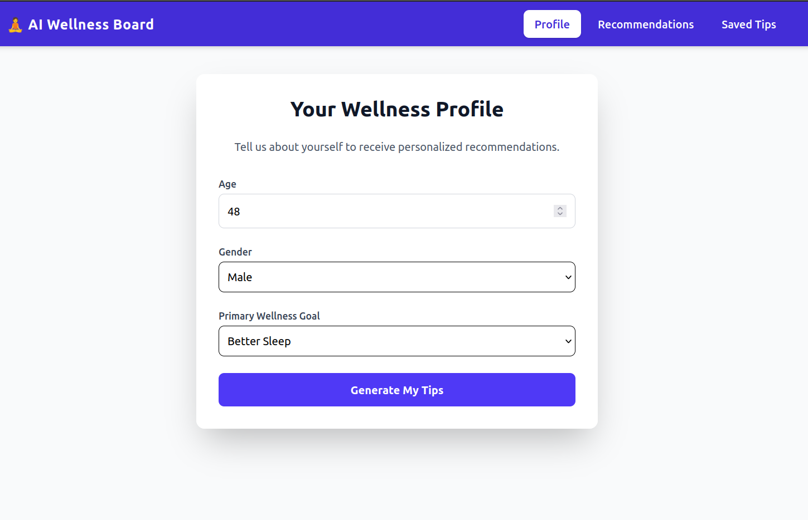
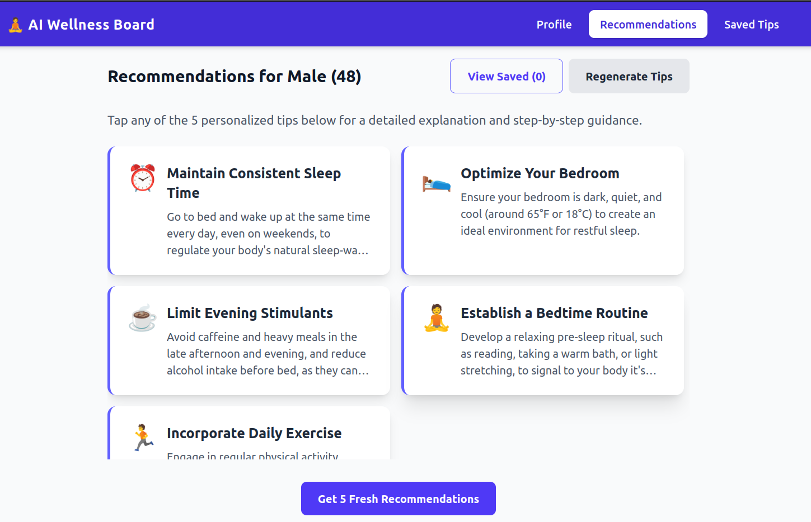
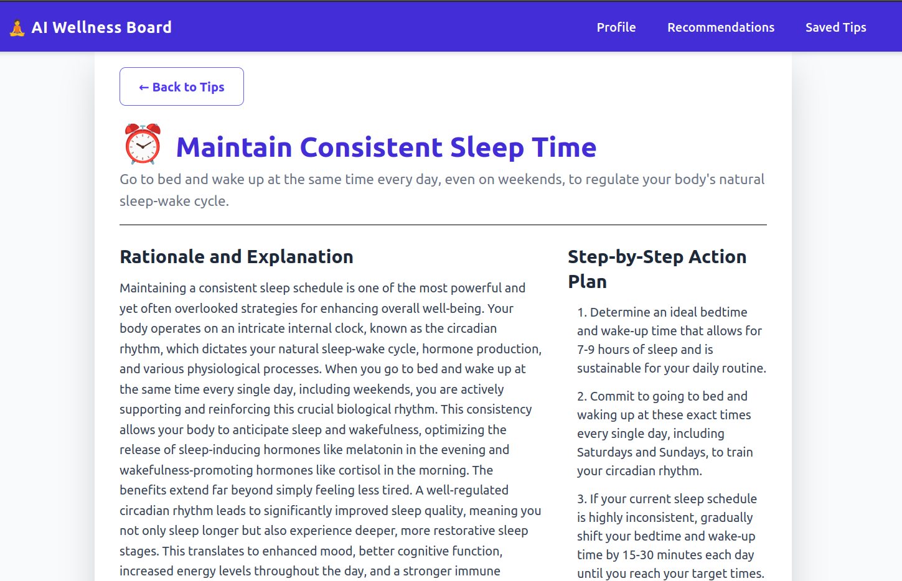
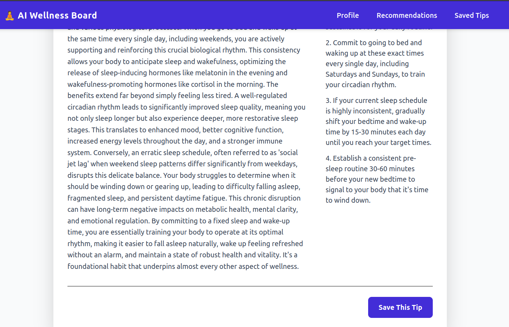
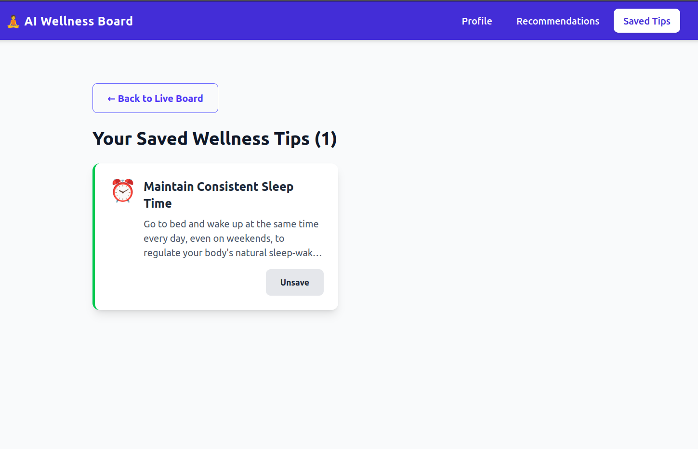

# 🧘 AI-Powered Wellness Recommendation Board

A personalized health and wellness web application built with **React (Vite)**, **Tailwind CSS**, and the **Gemini 2.5 Flash API**.  
It guides users through a structured 4-screen flow to capture their profile, generate AI-powered tips, view detailed step-by-step guidance, and save favorite tips with persistence.

---

## Table of Contents
- [Project Setup and Demo](#-project-setup-and-demo)
- [Problem Understanding](#-problem-understanding)
- [AI Prompts and Iterations](#-ai-prompts-and-iterations)
- [Architecture and Code Structure](#️-architecture-and-code-structure)
- [Screenshots](#-screenshots)
- [Known Issues and Improvements](#️-known-issues-and-improvements)
- [Bonus Work](#-bonus-work)

---

## Project Setup and Demo

### Technology Stack

| Technology                 | Purpose                     | Why it was Chosen                                                                 |
| :-------------------------- | :-------------------------- | :-------------------------------------------------------------------------------- |
| **React**                  | Frontend UI Library         | For building declarative, component-based user interfaces and efficient state management in a Single Page Application. |
| **Vite**                   | Build Tool & Dev Server     | For its lightning-fast development server, optimized builds, and out-of-the-box support for modern web development. |
| **Tailwind CSS**           | CSS Framework               | For its utility-first approach, enabling rapid UI development with highly customizable and consistent styling. |
| **Axios**                  | HTTP Client                 | For making efficient and reliable asynchronous HTTP requests to external APIs, particularly the AI service. |
| **React Context API + useReducer** | State Management Library | For handling global state management with predictable updates across components. |


### Prerequisites

- Node.js (v18 or higher)  
- npm or yarn  
- Gemini API Key

### Installation

```bash
# 1. Clone the repository
git clone https://github.com/Ankur7470/AI-Powered-Wellness-Board.git
cd AI-Powered-Wellness-Board

# 2. Install dependencies
npm install
# OR
yarn install
```

### API Keys Setup

This project relies on an external AI service to generate personalized wellness content. You will need an API key for this service.

1.  Create a `.env` file in the root of the project (same directory as `package.json`).
2.  Add your API key to this file. The exact variable name may depend on the AI service used, but a common practice for Vite projects is:
    ```dotenv
    VITE_AI_API_KEY="your_api_key_here"
    ```
3.  The key is accessed in code with: `const API_KEY = import.meta.env.VITE_GEMINI_API_KEY;`
4.  Remember to keep your API keys confidential and never commit your `.env` file to version control.

### Usage

Once the dependencies are installed and your API key is set up, you can start the development server:

```bash
npm run dev
# OR
yarn dev
```

The application will typically be available at `http://localhost:5173`.

---

## Problem Understanding

Most people find it difficult to discover wellness advice that feels **personal and relevant** to their own lifestyle.  
Generic tips can be overwhelming and often don’t match what a person really needs. Because of this, many struggle with **staying consistent, tracking progress, or following a routine**.

The **AI-Powered Wellness Board** solves this by creating a more **personalized experience**:

- It starts by capturing the **user’s profile** (age, gender, and wellness goal).  
- Based on that profile, it generates **5 clear and concise wellness tips** using AI.  
- Each tip can be expanded into a **detailed explanation** with easy, step-by-step actions.  
- Users can also **save their favorite tips**, which are remembered even after closing the app, thanks to local storage.  

This way, the board makes wellness guidance **simple, personal, and engaging**.

### Key Features
- **AI-Powered Personalized Tips** → Get custom recommendations that fit your profile.  
- **Interactive Wellness Board** → A clean, scrollable board to view and explore tips.  
- **Detailed Action Plans** → Each tip comes with a long explanation and step-by-step guide.  
- **Saved Tips & Persistence** → Save your favorite tips and access them anytime.  
- **Profile & Preference Management** → Adjust your personal details to get better recommendations.  
- **Robust State Management** → Powered by React Context + Reducer for smooth app flow.  
- **Error & Loading States** → Clear feedback and retry options during AI fetches.  
- **Navigation Bar** → Easy navigation across Profile, Recommendations, and Saved Tips. 

---

## AI Prompts and Iterations

The AI integration in this project is designed to ensure **reliable, structured, and personalized outputs**.  
To achieve this, two key strategies are used:

### 🔹 Strategy
- **Structured Prompting** → Every AI request is guided with strict JSON schema instructions. This guarantees the output is always valid JSON, making it easy to parse and display.  
- **Prompt Chaining** → The AI is called twice:  
  1. **First Prompt** → Generates exactly 5 concise wellness tips.  
  2. **Second Prompt** → Expands one selected tip into a detailed explanation and actionable steps.

### 🔹 Schemas
We enforce schemas to guarantee consistency:

#### TIPS_SCHEMA
Ensures exactly **5 tips**, each containing: `{ id, title, icon, summary }` 
```js
const TIPS_SCHEMA = {
  type: "object",
  properties: {
    tips: {
      type: "array",
      description: "An array containing exactly 5 personalized wellness tips.",
      items: {
        type: "object",
        properties: {
          id: { type: "string" },
          title: { type: "string" },
          icon: { type: "string" },
          summary: { type: "string" }
        },
        required: ["id", "title", "icon", "summary"],
      },
      minItems: 5,
      maxItems: 5,
    },
  },
  required: ["tips"],
};
```

#### DETAIL_SCHEMA
Ensures a **long-form explanation** (minimum 300 words) plus at least **4 clear steps** for action.
```js
const DETAIL_SCHEMA = {
  type: "object",
  properties: {
    explanation: { type: "string" },
    steps: {
      type: "array",
      items: { type: "string" },
      minItems: 4,
    },
  },
  required: ["explanation", "steps"],
};
```

### 🔹 Example Prompts
Below are simplified examples of how prompts are constructed:

#### Tips Prompt (`constructTipsPrompt`)
```js
"You are an expert wellness coach specializing in personalized, concise health recommendations.

    ### INSTRUCTIONS ###
    1. Analyze the user's profile and primary wellness goal provided below.
    2. Generate exactly 5 unique, highly relevant wellness tips.
    3. Do NOT include any introductory or concluding text. Your entire output MUST be a single JSON object.
    4. The JSON output must STRICTLY conform to the provided JSON Schema.

    ### USER PROFILE ###
    Age: ${profile.age}
    Gender: ${profile.gender}
    Goal: ${profile.goal}


    ### JSON SCHEMA ###
    ${JSON.stringify(TIPS_SCHEMA)}"
```

#### Detail Prompt (`constructDetailPrompt`)
```js
"You are an expert wellness coach. The user has selected one of your previously generated tips.

    ### INSTRUCTIONS ###
    1. Based ONLY on the selected Tip Context below, generate a comprehensive explanation and step-by-step advice.
    2. The 'explanation' must be a minimum of 300 words.
    3. The 'steps' array must contain at least 4 clear, sequential instructions.
    4. Do NOT include any introductory or concluding text. Your entire output MUST be a single JSON object.
    5. The JSON output must STRICTLY conform to the provided JSON Schema.

    ### TIP CONTEXT ###
    Tip Title: ${tipContext.title}
    Tip Summary: ${tipContext.summary}

    ### JSON SCHEMA ###
    ${JSON.stringify(DETAIL_SCHEMA)}"
```
This approach ensures the AI’s output is always predictable, valid, and easy to consume in the React frontend.

---

## Architecture and Code Structure

This project follows a **modular, layered architecture** to ensure clarity, maintainability, and scalability.  
The application is divided into screens, reusable components, a global state manager, and an AI service layer.

### 🔹 High-Level Flow
1. **Profile Setup (Screen 1)** → User enters age, gender, and wellness goal.  
2. **Tip Board (Screen 2)** → AI generates 5 personalized tips displayed as interactive cards.  
3. **Detail View (Screen 3)** → Selecting a tip triggers another AI call to provide a long explanation + action steps.  
4. **Saved Tips (Screen 4)** → Users can save favorite tips, which are persisted in local storage for future sessions.

### 🔹 Layers of the Application

#### 1. **Screens (`src/screens/`)**
These are the main pages of the app, each representing one step in the flow:
- `ProfileScreen.jsx` → Captures user inputs (age, gender, and wellness goal).  
- `TipBoardScreen.jsx` → Displays AI-generated wellness tips.  
- `DetailScreen.jsx` → Shows expanded tip details with explanation and steps.  
- `SavedTipsScreen.jsx` → Lists user’s saved favorite tips with remove option.

#### 2. **Components (`src/components/`)**
Reusable UI building blocks:
- `Button.jsx` → Custom styled button component.  
- `TipCard.jsx` → Displays individual tips with title, emoji, and summary.  
- `LoadingIndicator.jsx` → Shown while waiting for AI responses.  
- `ErrorMessage.jsx` → Displays error messages when API calls fail.  
- `Navbar.jsx` → Provides persistent navigation across screens.

#### 3. **State Management (`src/contexts/`)**
- **`WellnessContext.jsx`** → Uses React Context + Reducer for global state.  
  - Manages profile, tips, detailed tip, saved tips, and async states (loading/error).  
- **`actions.js`** → Defines all action types (e.g., `SET_PROFILE`, `FETCH_TIPS_SUCCESS`, `SAVE_TIP`).  

This ensures centralized state control and predictable updates.

#### 4. **AI Service Layer (`src/aiService/`)**
Responsible for all AI interactions (Gemini API):
- `api.js` → Handles API requests and error handling.  
- `prompts.js` → Builds dynamic prompt strings.  
- `schemas.js` → Defines strict JSON structures (`TIPS_SCHEMA`, `DETAIL_SCHEMA`).  
- `index.js` → Exposes clean service functions (`generateTips`, `getTipDetail`).  
- `config.js` → Handles API key and environment setup.

This abstraction separates AI logic from React components, improving modularity.

#### 5. **Custom Hooks (`src/hooks/`)**
- `useLocalStorage.js` → Syncs saved tips with browser local storage for persistence across sessions.

#### 6. **App Core**
- `App.jsx` → Hosts the navigation logic, rendering screens based on current state.  
- `main.jsx` → Entry point that initializes React, Context Provider, and mounts the app.  

### 🔹 Project Structure Overview

```
AI-powered-Wellness-Board/
├── public/                     
│   └── vite.svg
├── src/                        
│   ├── aiService/              
│   │   ├── api.js              
│   │   ├── config.js           
│   │   ├── index.js          
│   │   ├── prompts.js         
│   │   └── schemas.js        
│   ├── assets/                 
│   │   └── react.svg
│   ├── components/             
│   │   ├── Button.jsx
│   │   ├── ErrorMessage.jsx
│   │   ├── LoadingIndicator.jsx
│   │   ├── Navbar.jsx
│   │   └── TipCard.jsx         
│   ├── contexts/               
│   │   ├── WellnessContext.jsx 
│   │   └── actions.js          
│   ├── hooks/                 
│   │   └── useLocalStorage.js  
│   ├── screens/                
│   │   ├── DetailScreen.jsx    
│   │   ├── ProfileScreen.jsx   
│   │   ├── SavedTipsScreen.jsx 
│   │   └── TipBoardScreen.jsx  
│   ├── App.css                 
│   ├── App.jsx                 
│   └── main.jsx 
├── .env                
├── .gitignore                  
├── eslint.config.js           
├── index.html                  
├── package-lock.json           
├── package.json                
├── postcss.config.js           
├── README.md                   
├── tailwind.config.js          
└── vite.config.js              
```

### 🔹 Key Design Principles
- **Separation of Concerns** → UI, state, and AI service are clearly separated.  
- **Scalability** → New screens or AI features can be added without breaking existing flow.  
- **Persistence** → Saved tips are stored locally to enhance user experience.  
- **Error Handling** → Clear loading and error states ensure smooth UX even during API failures.  

This architecture makes the app **clean, predictable, and easy to extend** — meeting all requirements for the wellness board assignment.

---

## Screenshots

Below are some sample screenshots showcasing the flow of the application.  

### 1. Profile Screen
Captures user details such as **Age, Gender, and Wellness Goal**.  


---

### 2. Tip Board Screen
Displays **5 AI-generated personalized wellness tips** in an interactive card layout.  
Includes options to **regenerate tips** and navigate to details.  


---

### 3. Detail Screen
Provides a **long explanation (300+ words)** and **step-by-step action plan** for the selected tip.  
Users can save tips to favorites from here.  



---

### 4. Saved Tips Screen
A dedicated board that displays all **favorite tips saved by the user**.  
Tips are stored in **local storage**, ensuring persistence across sessions.  


---

### Hosted Demo
You can also explore the app live here:  
👉 [Hosted Demo Link](https://ai-powered-wellness-board.vercel.app/)  

---

## Known Issues and Improvements

### Known Issues

- **AI Output Errors**  
  Sometimes the Gemini model may return malformed or incomplete JSON despite schema enforcement. This leads to errors like *"AI output was malformed JSON"*.  

- **Emoji Inconsistency**  
  In some cases, the AI returns the **name of an emoji** (e.g., `"smiling face"`) instead of the actual emoji character (😊).  

- **Generic Error Messages**  
  Error messages shown to the user are not very descriptive. For example, errors from tip generation and detail generation are currently handled in the same way.  

- **Persistence Limitation**  
  Local storage is used for saving tips, which works well but has limitations, such as no multi-device sync.  

- **Performance Overhead**  
  Since all state is stored in a single context provider, unnecessary re-renders can occur, affecting performance on lower-end devices.  

### Improvements

- **Better Error Handling**  
  Add more specific error states (e.g., `DETAIL_FAILURE`, `TIPS_FAILURE`) with clear and user-friendly retry prompts.  

- **Enhanced Persistence**  
  Introduce cloud sync or backend storage for saved tips so users can access them across multiple devices.  

- **UI/UX Polish**  
  Improve screen transitions with animation libraries like **Framer Motion** for smoother interactions.  
  Add accessibility features such as ARIA labels, proper semantic elements, and keyboard navigation.  

- **Multi-Language Support**  
  Provide recommendations in multiple languages to make the app accessible to a wider global audience.  

---

## Bonus Work

Some potential enhancements that go beyond the base requirements:

- **Advanced Personalization:**  
  Expand the profile with additional factors (sleep, stress, work-life balance) to generate even more tailored tips.
  
- **Offline Mode:**  
  Cache previously generated tips so users can view them without internet access.


